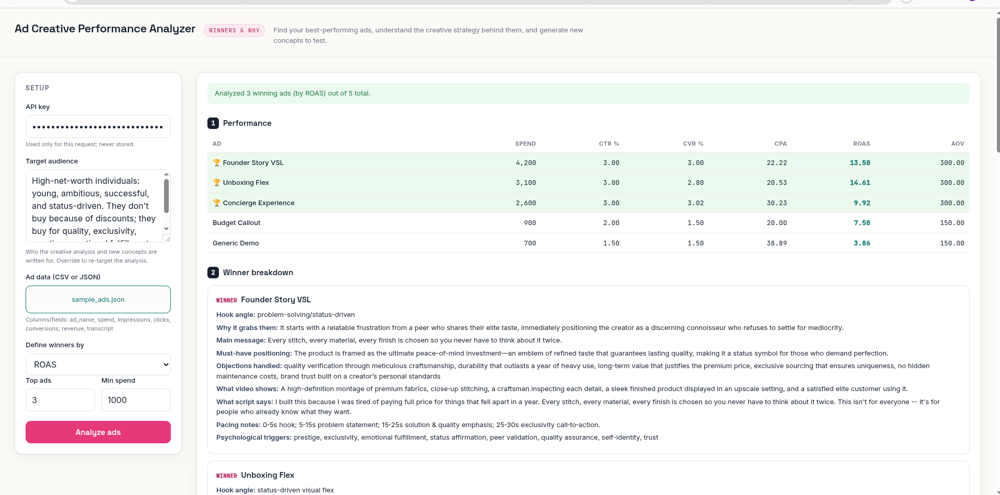
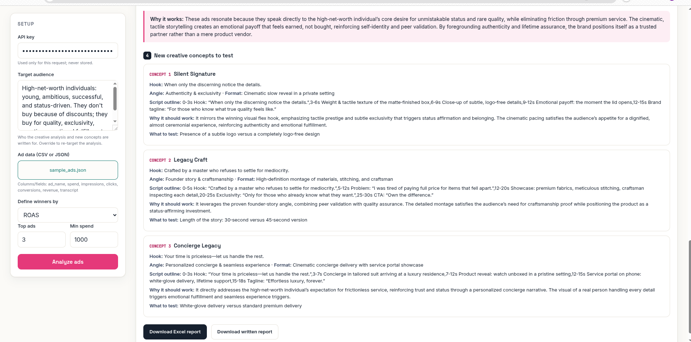

# AI Ad Creative Performance Analyzer

Takes ad performance data with creative transcripts, identifies the top
performers by ROAS, CPA, CTR or CVR, and uses an LLM to break down why each
winner works: hook, angle, psychological triggers, and the pain points it
targets. Then generates new concepts, hooks and scripts to test.

Built as a FastAPI backend with a REST API and an HTML/JS frontend, so the
data and LLM pipeline stays separate from the UI.



## Features

- **Deterministic performance metrics** — CTR, CVR, CPA, ROAS and AOV are
  computed in Python, never guessed by the LLM.
- **REST API** — a documented `/api/analyze` endpoint callable from any
  client, plus a built-in web UI.
- **Winner detection** — rank ads by ROAS, CPA, CTR, CVR or revenue, with a
  minimum-spend filter.
- **Creative breakdown** — hook, hook type, angle, format, psychological
  triggers, and the pain points / desires each winner targets.
- **Pattern synthesis & audience insights** — what the winners share and why
  it works with this audience.
- **New concept generation** — ready-to-brief ad concepts with hooks,
  scripts, and a clear "what to test".
- **Exports** — multi-sheet Excel report and a shareable written report,
  served as download endpoints.

## Tech Stack

Python · FastAPI · Uvicorn · HTML / CSS / vanilla JS · LLM API · pandas · openpyxl

## Getting Started

```bash
git clone https://github.com/VanguardXs/ai-ad-analyzer.git
cd ai-ad-analyzer
pip install -r requirements.txt
uvicorn main:app --reload
```

Open `http://127.0.0.1:8000`, enter your API key, upload `sample_ads.csv` (or
`sample_ads.json`), and run the analysis.

Interactive API docs are auto-generated at `http://127.0.0.1:8000/docs`.

## API

| Method | Endpoint | Description |
| --- | --- | --- |
| `GET` | `/` | The web app |
| `POST` | `/api/analyze` | Multipart form: `file` (CSV or JSON), `api_key`, `metric`, `top_n`, `min_spend` → JSON results |
| `GET` | `/api/download/{report_id}/excel` | Download the Excel report |
| `GET` | `/api/download/{report_id}/report` | Download the written report |



## Input Format

Either a CSV or a JSON file, one record per ad, with fields:
`ad_name, spend, impressions, clicks, conversions, revenue, transcript`.

- CSV: standard header row, e.g. `sample_ads.csv`.
- JSON: an array of objects with the same fields, e.g. `sample_ads.json`.
  This is the shape ad platform APIs (e.g. Meta Ads) typically return, so
  accepting it directly is a step toward pulling data straight from those
  APIs instead of exporting to CSV first.

The file type is detected from the upload's filename extension
(`.csv` vs `.json`).

## Project Structure

```
.
├── main.py              # FastAPI backend (API + serves the UI)
├── ad_core.py           # Metrics, LLM analysis/synthesis, Excel & report export
├── static/
│   ├── index.html       # Frontend markup
│   ├── style.css        # Styles
│   └── app.js           # Frontend logic (calls the API)
├── sample_ads.csv       # Example dataset (CSV)
├── sample_ads.json      # Example dataset (JSON)
├── requirements.txt
├── .env.example
└── .gitignore
```

## Roadmap

The same pipeline can be fed from ad platform APIs (e.g. Meta Ads) and run on
a schedule to deliver recurring reports to Slack, Notion or a dashboard.
Not implemented yet.

## License

Released under the [MIT License](LICENSE).
